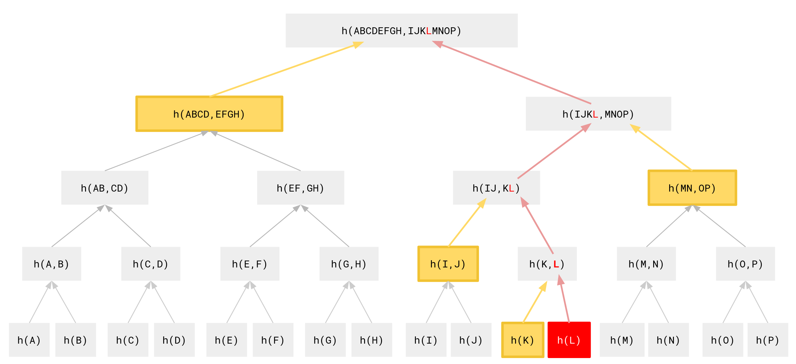

# What is a proof and why do you need one?

Decentralized apps rely heavily on blockchain state to display current and historical values like an account's balance, its NFT holdings, or current exchange rates on DEXes. Projects like The Graph or Covalent make blockchain data accessible, chain indexers like Etherscan provide historical information about the chain's state, and RPC providers like Infura or Alchemy allow wallet extensions like Metamask to connect to their full-node infrastructure. However, unless you run your very own full-node you cannot prove that any value provided by these sources truly resembles the chain state they represent. In short: relying on external, centralized services imposes a trust risk. However, the way how Ethereum stores data allows trusting the chain state data without trusting the provider itself, thanks to proofs. This is how it works.

## Ethereum's storage model

Ethereum uses a tree-based storage model that contains each account's balance and the storage for contract-based accounts. All values are wrapped in a traversable hash trie structure - a [Patricia Merkle Trie](https://ethereum.org/en/developers/docs/data-structures-and-encoding/patricia-merkle-trie/) - that allows creating cryptographic hash proofs for each tree node. The state root hash of a block represents the complete state of all accounts and contracts at a given block height, aka the _world state_. Block producers execute new transactions on their local state copy and bundle the resulting new state root hash and a list of all executed transactions into a new block.

Light Ethereum clients cannot verify the current chain's state since they're not keeping a full copy of the world state. Full nodes can rebuild the state tree by executing every transaction since genesis, and then constantly update it as new blocks arrive. To save storage space they only keep the most recent chain states and hence cannot respond to state queries from the past, i.e. they're not able to determine an account's balance older than - depending on the node's settings - 64 blocks. That's sufficient to create proofs about the current state, though.

## Cryptographic proofs on hash trees

Merkle trees use hashes of their nodes' values as keys to guarantee their content integrity. To build a simple binary Merkle tree, a prover starts by computing a hash over a node `L`'s content `h(L)`. Next, they compute the hash over `h(L)` and the hash of a sibling content node `K`: `h(h(K)+h(L))`. Using this hash as a key they create a new node `KL` with `h(K)` and `h(L)` as children and find another node `IJ` at the same tree level to create a new parent node that hashes all values of the underlying tree structure: `h(IJ + KL)` = `h(h(h(I) + h(J)) + h(h(K) + h(L)))`. This process is repeated until all nodes are combined to a single root hash. Since each parent node keeps a hash of its children, it's impossible to change anything down the tree without affecting the tree's root node.



To prove that a certain base value has been incorporated into a Merkle tree's root, one collects the hashes of sibling nodes at each level of the tree. A prover successively computes their hash sums to finally recreate the root hash, thereby proving the inclusion of the node's value.

A simple way of storing binary Merkle trees in a flat key/value database structure is with [radix tries](https://en.wikipedia.org/wiki/Radix_tree). To store a node, one splits its hexadecimal hash key into its nibbles (the hex characters) and create subdirectories for each of them. A node with the key `0xcafe` would end up in a folder structure like `c/a/f/e/value`. Looking up a node requires traversing the directory structure along the key's nibbles down to the last nibble's directory where the node's value will be stored. While simple to understand this approach is far too inefficient to store large tree data structures like Ethereum's world state. The network instead uses Patricia Merkle Tries that add some complexity to the data structure by introducing branch-, extension-, leaf- and null-nodes but are way more efficient to store and traverse. Additionally, a Recursive Length Prefix ([RLP](https://ethereum.org/en/developers/docs/data-structures-and-encoding/rlp/)) encoding is used to serialize nested arrays and data structures.

## Proving account state

Ethereum's state trie consists of a mapping between account addresses and their state, defined by their current `nonce` and `balance` and in the case of contract accounts a `storageRoot` key that points to a position in the dedicated contract storage trie and their binary code hash. Just using a block's `stateRoot` one can look up an account's current state at that height using a full node's LevelDB (Geth's default storage database). Our examples are using an archive node of Ethereum's recently launched [Sepolia testnet](https://sepolia.dev/) because it's still small enough to be synced to a developer's machine.

```js
const { SecureTrie } = require("merkle-patricia-tree");
const {
  toBuffer,
  bufferToHex,
  keccak256,
  Account,
} = require("ethereumjs-util");
const Web3 = require("web3");

const web3 = new Web3("http://127.0.0.1:8545");
const db = new Level(".ethereum/sepolia/geth/chaindata");

async function getState(address, blockNumber) {
  const block = await web3.eth.getBlock(blockNumber);
  const trie = new SecureTrie(db, toBuffer(block.stateRoot));

  //retrieves the account node's *value*
  const rawValue = await trie.get(toBuffer(address));
  const account = Account.fromRlpSerializedAccount(rawValue);
  console.log(account);
}
```

`getState("0xe127a39da6ea2d7b1979372ae973a20bab08a80a", 1432400)` yields:

```
account Account {
  nonce: <BN: 2>,
  balance: <BN: 1f3d52b3c4f92e45d>,
  stateRoot: <Buffer 56 e8 1f 17 1b cc 55 a6 ff 83 45 e6 92 c0 f8 6e 5b 48 e0 1b 99 6c ad c0 01 62 2f b5 e3 63 b4 21>,
  codeHash: <Buffer c5 d2 46 01 86 f7 23 3c 92 7e 7d b2 dc c7 03 c0 e5 00 b6 53 ca 82 27 3b 7b fa d8 04 5d 85 a4 70>
}
```

The provided account is an EOA, hence the `codeHash` value corresponds to `keccak256([])` (another expression of a null value) and `stateRoot` is the hash of an RLP encoded zero: `keccak256(rlp.encode(0))`.

To create a proof of the account node's value against a block's state root you walk down the patricia trie starting at the block's `stateRoot` node, resolve the paths on the trie's branch and extension nodes according to the signposts expressed by the leaf node's nibbles until the wanted leaf node is reached. On the way we're keeping track of all nodes we see while traversing the path. More details about the traversal [can be found here]([ethereumjs-monorepo/trie.ts at cfd7b7754490b072a035cceaba59c3dfb517effd · ethereumjs/ethereumjs-monorepo · GitHub](https://github.com/ethereumjs/ethereumjs-monorepo/blob/cfd7b7754490b072a035cceaba59c3dfb517effd/packages/trie/src/trie/trie.ts#L154)). We're using only high level methods to show proof creation here:

```js
const { SecureTrie } = require("merkle-patricia-tree");
const { toBuffer, keccak256 } = require("ethereumjs-util");

const db = new Level(".ethereum/sepolia/geth/chaindata");
const trie = new SecureTrie(db, toBuffer(block.stateRoot));

//create a proof by finding the path on our own:
const { node: accountNode, stack } = await trie.findPath(
  keccak256(toBuffer(address))
);
const proof = stack.map((stackElem) => {
  return stackElem.serialize();
});

//or by using a trie's convenience method:
const proof = await SecureTrie.createProof(trie, toBuffer(address));

//or by using the ethereum node's RPC interface
const { accountProof: proof } = await web3.eth.getProof(
  address,
  [0],
  block.number
);
```

All three `proof` s contain the same array of RLP encoded proof nodes, with our account node at its end:

```json
[
  "0xf90211a078400dd6bd6f6cc13cdde5b707bdb6b9802fbd11809cba8aab2ee72f6920bbf3a0d88879eb6f43ea2d9c07538601e041aa46d64c87df68296a552ad12f8e5bebc0a044d40ac93c1bce308feda36a7712a38d9508087f04e612b1411bc57f80fa77a8a0b92c5fc0dcbc4a7982563c3667b940117770965e5f447578e4bde4fefcbb6d5aa0bc555b313ac90177e117dc10917581dad616770625e0956feb0df75a4be2ce63a0bd19008ae54cf1af36e59d7c92c553693dd468a0ef86c89401d01fc84aa4b751a0ee549b7ab8dd9a565ee6507bb46b9033e57b3a07541a4085763207911633367ca05652bd80f5b970a09c2090c38b13afa1772f3d97422c9a16548acdf629c35113a0a2e78f2d0da2d7218535b94bd69c4fad4425ff3bb22304d722185cf99dac2596a0a9470e771ae9cec5535b057948e68c4c38d8b8c1c2d8ed180d8f5244c63e422ea0726d10a2a5c85b156105414e75591611d896b8aaebd7fc92535845445a8baa81a0fdfb5aa2c35136eab67c3539d3ba34648bb8542b57e745976d52bca263ab19d7a01eafa4a1f59d28009a03b24d9a11c878faa78fe7ef3ecc4ef8891a77fea3fa35a02c980b0a841d5ec1978ae63adf7ba2727ac125f792f545cb0146d8df46adbdbfa052b97e4692fd69b4bebc6ceca258032319b07aca2ee62b504285031670fbc073a02c415e41b6bf838a8b742123fda110703ffdedea8834bb5113ae26f81887668e80",
  "0xf90211a098e0b7071d2b8d890cca479dba9f5b697d639d70d51f0312c5b8a27afc31a23da060759f93f482f66b233480a4cd060372567752b9dae507045b266600ab9b290da0c35bb5b2aae7eb8bc75a9de125daab9caa7d6d39e403153c9b34e51dcde46f78a097a4c1ba8ac42378481754eac9306b62d3d176602098820cb87e3c7f4091734da074b2785ca9199d0c68e2fa6dd01dcc24791887616adf8043cda56651cff25e87a00937963d57bc119144ebeff9bb99dcbef11aed563fd41818aaf0de89d15364b3a000ba5def8acd7c1c2af85ef49bc5d144fa1ceef93e81e9e64ad6457ab92cb569a069cd4b3ac6b03b1928f50840f81086ff0c819d1cbd445db0e5c306cfce9c0728a0a78339d0b9405da5a7943a6ac97b9585767a6f9f0e481b5e197d8fd820ac1cfaa019e1319ade8f1c2254dcef0b68483240044bc6bee2ea8197de895eb427068b1aa0ef36884df92b5769e521c6c0feaead503a8d70d11f493b3e6c8170ac917ced92a079c1ffdaa2a8d4ddacac77f47b43f1553c634300d23a8003574ec90874547cbaa0de4f130f1fd52baf5229e3871394b6f0562c64576039c6c38d06c695b7d87b07a09668798efa8c1e9b860d9f4a49b65db83c22fefd92f703a5875b87c7ae11bdf4a087ca8f145dbc9ad7f88468dbec0627d77ced63a508b4d7a5d28439e89c6be8e4a04fdb75be4fce4d76e41578f0bbcfdc2ded74d59855c9f3afc73c3659b9e28aa980",
  "0xf90211a058d99773cf489bd86bac2c6452c20cc7056f3505d7f96d83480cf85336d0da85a07dc4216585f73a213fb1828076cf7d93d8ce95e1981a5c8eb11d7166af8433eba0f85f31a95a1f83516719ae596266afdc529aa4ff9af8f0f6c1d7da6751f07d70a0f1371490b8ef31ce814673e9ecf0f498f2ec9eedcd554e93162d5c0e99e77d69a01d9709211cc089eba15fe3c052539203d11235b219e1c72e0172c9bec1d317bea09e907ad084233149719b5c6f8b4777a617b41744a0c3e9f6ef002970465a0656a044f3abc34546455ba2ed3d64ead41c734d5f56c240f8f8adfd971179538ca0efa08403716832691c8867b1366421b703925ff28e45d6f4360f898b70461e29d4eda0d8f4711ffe7bc79040b2f397523786a67d72814e8af9b65c9e03c318bb0eba48a0db84d2a268e67d6e45af7cd18a92fab1df496180e9ba8f0f0b620ab6344457cba0d01707094316206d689d80ed2684cda3aadd72ee2d4efbe1437bb194aa0adc87a0355e0e203341ac995bf2d90937f1ce807a13624e9d3831476f3205838b84f191a083961a9b498b791ee8e6a110a87aca2f2cea629df0827f4fbd168567d7246207a05d312338764151dc1936485637367ad9d9c440b4b0dde368dec4dbd5aaf51f4ea076b77567690221701e2edfff06f1c84a25b3181e4c8aa3bed2b3e3797a883564a0975b63f1be5615a4a68ec7f313abc0784def11a352975c40e886e03df95f764e80",
  "0xf9013180a0944968a4a8c7ba1e91cbb2414471a67f16c74e2ef6ac87447af0402520aed9c88080a03f3e1fed1008e242b89ce5b56106a091f946826c539f23ecee74c5b36b5d38cca041b58c41b5435e10c9b9f6b1f1bdf3d5e0294dfcfbf59b7a8c80475249e1d9e6a0d0b42862dcb175e47bf17614bd251b17cdab2710ba13175fd9b8c17afdc0893ba0ff4dc7ee613a7805802e50d39c3c8d8b35db63ceda7371502c5d119eca0a7b1780a0cd328766d44f930edc3a32ae5fd2a791f0de4dbabe014c4be77fc63b4b427310a0c20a6a1812f18d0c446408f90b09d0b592a07c45d06e780b49c6ad68e7c92bc5a084688c931305a75246f9d527a07483cff6e9ffbe4746a22ca65e07d3b3c6045f8080a0515f82b6e34b4713edead2652f266fdcea3729d64217113db564e918a9b1ed408080",
  "0xf8518080a06b91f274ef06ab455966416f6bb3779519bf72c68e85ec4b61ff8b99aa73a1818080a0937ee4540dc495eaa3cd61e12a4f6158a6be147d71ac3955a50ecd080e9732698080808080808080808080",
  "0xf8709e3e0484bbc22108bc77412e65255ce0387dc7c6a8d1917625ddb60ccbd98fb84ff84d028901f3d52b3c4f92e45da056e81f171bcc55a6ff8345e692c0f86e5b48e01b996cadc001622fb5e363b421a0c5d2460186f7233c927e7db2dcc703c0e500b653ca82273b7bfad8045d85a470"
]
```

To verify this proof one doesn't need to have access to a full state tree at that block height. It's sufficient to know (and trust, e.g. by running a light node) the proof block's `stateRoot`:

```js
const { SecureTrie } = require("merkle-patricia-tree");
const { toBuffer, keccak256, Account } = require("ethereumjs-util");

// look Ma, no ethereum node needed
// @param stateRoot hexString: the block's stateRoot
async function verifyAccountProof(address, proof, stateRoot) {
  const proofBufs = proof.map((p) => toBuffer(p));
  //build a new trie using only the proof nodes. They will hash towards the block's stateRoot
  const proofTrie = await SecureTrie.fromProof(proofBufs);

  //the account node can also be retrieved from the partial trie:
  const accNodeRaw = await proofTrie.get(keccak256(toBuffer(address)));
  const account = Account.fromRlpSerializedAccount(accNodeRaw);

  console.log("proven value", account);
  const valid = await proofTrie.checkRoot(toBuffer(stateRoot));
  //or: const valid = bufferToHex(proofTrie.root) == stateRoot;
  return valid;
}
```

## Proving contract state

Proofs over contract state are created accordingly. They are rooted at the contract account's own `stateRoot` member variable that points to the mutable root of the contract's storage trie. Storage slots are addressed by their position hash [as outlined in the Solidity documentation]([Layout of State Variables in Storage &mdash; Solidity 0.8.15 documentation](https://docs.soliditylang.org/en/v0.8.15/internals/layout_in_storage.html#mappings-and-dynamic-arrays)) and are stored as leaf nodes in the storage trie. To simplify this procedure, we're going to use `eth_getProof` calls here as described in [EIP-1186](https://eips.ethereum.org/EIPS/eip-1186) and supported by all major chain node implementations and service providers. Lets prove [this contract](https://sepolia.etherscan.io/address/0xF492600AeD292b1B94A1ba0CD29fB6ed6d6ab872)'s `greeting` to be "`Hello, Hardhat!`" at Sepolia block number `1391140` :

```solidity
pragma solidity ^0.8.0;

contract Greeter {
    string private greeting;

    constructor(string memory _greeting) {
        greeting = _greeting;
    }

    function setGreeting(string memory _greeting) public {
        greeting = _greeting;
    }
}
```

Now, lets create a proof of its storage slot 0 (the string variable `greeting` ):

```js
const { bufferToHex } = require("ethereumjs-util");
const { SecureTrie } = require("merkle-patricia-tree");
const Web3 = require("web3");

const web3 = new Web3("http://127.0.0.1:8545");

const proveContractStorage = async (blockNumber) => {
  const proof = await web3.eth.getProof(
    "0xf492600aed292b1b94a1ba0cd29fb6ed6d6ab872", //the contract's address on Sepolia
    [0], //the first storage slot
    blockNumber
  );
  console.log(proof.storageProof);
  const value = web3.utils.hexToAscii(proof.storageProof[0].value);
  console.log(value);

  const proofBufs = proof.storageProof[0].proof.map(toBuffer);
  const proofTrie = await SecureTrie.fromProof(proofBufs);
  const valid = bufferToHex(proofTrie.root) == proof.storageHash;
  console.log(valid);
};
```

```
[
  {
    key: '0x0',
    value: '0x48656c6c6f2c204861726468617421000000000000000000000000000000001e',
    proof: [
      '0xf8518080a0e2a22c03c4f21673563d55cbad16de4c4affc9a54c3eea063ce358ccd6d02c4c8080808080808080a0fc47ec7aea920817d850c758a8fd61ecc89b967b2fe8d9ec6d00feedeb0a7d658080808080',
      '0xf843a0390decd9548b62a8d60345a988386fc84ba6bc95484008f6362f93160ef3e563a1a048656c6c6f2c204861726468617421000000000000000000000000000000001e'
    ]
  }
]
Hello, Hardhat!
true
```

### A non trivial example

Creating proofs over nested structures, dynamic types like strings, or deeply buried storage slots is slightly harder because you have to be familiar with Solidity's [storage layout](https://docs.soliditylang.org/en/v0.8.15/internals/layout_in_storage.html). To demonstrate that, here is a non-trivial example to prove that Jimmy Fallon owned [Bored Ape #599](https://opensea.io/assets/ethereum/0xbc4ca0eda7647a8ab7c2061c2e118a18a936f13d/599) at block height [
13572667](https://etherscan.io/block/13572667) as he claimed during his Tonight Show [in January 22](https://www.youtube.com/watch?v=5zi12wrh5So&t=222s). The Bored Apes NFT contract inherits from OpenZeppelin's legacy V3 [enumerable ERC721 contract](https://github.com/OpenZeppelin/openzeppelin-contracts/blob/v3.4.2/contracts/token/ERC721/ERC721.sol#L36). The data structure storing ownership information about a single token is the private `_tokenOwners` member struct that maps a token id to an index onto another dynamic array of key value mappings.

To prove the ownership storage values we need to take a look at the contract's `ownerOf` implementation and its related structs. Here's a summary of the relevant parts of the [full BAYC code base](https://etherscan.deth.net/address/0xbc4ca0eda7647a8ab7c2061c2e118a18a936f13d#code):

```solidity
library EnumerableMap {
  struct MapEntry {
    bytes32 _key;
    bytes32 _value;
  }

  struct Map {
    MapEntry[] _entries;
    // Position of the entry defined by a key in the `entries` array, plus 1
    // because index 0 means a key is not in the map.
    mapping (bytes32 => uint256) _indexes;
  }

  struct UintToAddressMap {
    Map _inner;
  }

  function _get(Map storage map, bytes32 key) private view returns (bytes32) {
    uint256 keyIndex = map._indexes[key];
    require(keyIndex != 0, "EnumerableMap: nonexistent key"); // Equivalent to contains(map, key)
    return map._entries[keyIndex - 1]._value; // All indexes are 1-based
  }

  function get(UintToAddressMap storage map, uint256 key) internal view returns (address) {
    return address(uint160(uint256(_get(map._inner, bytes32(key)))));
  }
  //...
}

contract ERC721 is Context, ERC165, IERC721, IERC721Metadata, IERC721Enumerable {

  // Mapping from holder address to their (enumerable) set of owned tokens
  mapping (address => EnumerableSet.UintSet) private _holderTokens;

  // Enumerable mapping from token ids to their owners
  EnumerableMap.UintToAddressMap private _tokenOwners;

  function ownerOf(uint256 tokenId) public view virtual override returns (address) {
    return _tokenOwners.get(tokenId, "ERC721: owner query for nonexistent token");
  }
  //...
}
```

The index mapping `_tokenOwners` is the contract's third storage member (the 1st one being part of the ERC-165 implementation) and it implicitly points to the `Map` struct via `UintToAddressMap.inner`, occupying two storage slots. By applying Solidity's [layout rules for dynamic arrays](https://docs.soliditylang.org/en/latest/internals/layout_in_storage.html#mappings-and-dynamic-arrays), the storage slot's address of the enumeration index that points to the current owner of token #599 can be computed as `const indexSlot = web3.utils.soliditySha3(599, 3);`. Querying that storage slot's value by `web3.eth.getStorageAt(baycAddress, indexSlot, blockNumber)` yields the index `0x258` at the given block height. Considering that the `Map._entries` array starts at the contract's third slot, it takes two slots to store one `MapEntry` and the indexes are 1-based we can resolve the map's `_value` member that carries the token owner's address like so: `soliditySha3(2) + (0x258 * 2) - 2 + 1`

With that we can construct two storage proofs for the index and the owner's address:

```js
const baycAddress = "0xbc4ca0eda7647a8ab7c2061c2e118a18a936f13d";
const blockNumber = 13572667;

const indexSlot = web3.utils.soliditySha3(599, 3);
// -> 0x7e2616eb7a75f68a32624f502cf2cabc166c302900bbdc790c2fb85cea316a21
const indexValue = await web3.eth.getStorageAt(
  baycAddress,
  indexSlot,
  blockNumber
); //0x258

const bnIndex = ethers.BigNumber.from(indexValue);
const valueSlot = ethers.BigNumber.from(web3.utils.soliditySha3(2))
  .add(bnIndex.mul(2))
  .sub(2)
  .add(1);
// -> 0x405787fa12a823e0f2b7631cc41b3ba8828b3321ca811111fa75cd3aa3bb5f7d

const proof = await web3.eth.getProof(
  baycAddress,
  [indexSlot, valueSlot],
  blockNumber
);
```

To prove the _value_ of the yielded proof, we can:

```javascript
async function validateStorage(proof, slot, proofIdx) {
  const proofBufs = proof.storageProof[proofIdx].proof.map(toBuffer);
  const pTrie = await SecureTrie.fromProof(proofBufs);
  const valid = pTrie.checkRoot(toBuffer(proof.storageHash));
  const rlpNode = await pTrie.get(toBuffer(web3.utils.keccak256(slot)));
  console.log("content at slot", slot, bufferToHex(rlp.decode(rlpNode)));
  return valid;
}

console.log(await validateStorage(proof, indexSlot, 0));
console.log(await validateStorage(proof, valueSlot.toHexString(), 1));
```

```
content at slot 0x9f82913e56c1ea296cd5a3c46bc89a4073098f41767359e4c3742445923985c7 0x0258
true
content at slot 0xd4790f3899b463e8194660196b97cf3ff9c47008d83ca7c0e51ce406d3c784e5 \
0x0394451c1238cec1e825229e692aa9e428c107d8 (<- Jimmy Fallon's address)
true
```

## Validating proofs inside smart contracts

These have been client side examples, but proofs can also be validated inside Solidity contracts, e.g. to prove historical chain information that's not available to the contract itself. A good example can be seen at Lido Finance's [trustless ETH/stETH price pool oracles](https://github.com/lidofinance/curve-merkle-oracle) that receives price reports as a combination of block header, account and state proofs. Since proofs are submitted [as memory variables](https://github.com/lidofinance/curve-merkle-oracle/blob/main/contracts/StableSwapStateOracle.sol#L295), price updates [are relatively cheap](https://etherscan.io/tx/0xb24e20813e08f75e12e29da53f7f6c7e5dca7be68f3d3247edd4de572c527df4). Here's a contract that's built on [Lido's primitives](https://github.com/lidofinance/curve-merkle-oracle/tree/main/contracts) and verifies any given state proof. It's also [deployed on Görli](https://goerli.etherscan.io/address/0x52e357f616a13089435be73e20cffb788eb4c928#code):

```solidity
// SPDX-License-Identifier: MIT
pragma solidity 0.6.12;
pragma experimental ABIEncoderV2;

import "./StateProofVerifier.sol";
import {RLPReader} from "solidity-rlp/contracts/RLPReader.sol";

contract ProofVerifier {
    using RLPReader for bytes;
    using RLPReader for RLPReader.RLPItem;
    using StateProofVerifier for StateProofVerifier.Account;

    /*
    struct Account {
        bool exists;
        uint256 nonce;
        uint256 balance;
        bytes32 storageRoot;
        bytes32 codeHash;
    }

    struct SlotValue {
        bool exists;
        uint256 value;
    }
    */

    function extractAccountFromProof(
        address _address,
        bytes32 _stateRootHash,
        bytes memory _proofRlpBytes
    ) public pure returns (StateProofVerifier.Account memory account) {
        RLPReader.RLPItem[] memory proofs = _proofRlpBytes.toRlpItem().toList();
        bytes32 addressHash = keccak256(abi.encodePacked(_address));

        account = StateProofVerifier.extractAccountFromProof(
            addressHash,
            _stateRootHash,
            proofs
        );
    }

    function extractSlotValueFromProof(
        bytes32 _slotHash,
        bytes32 _storageRootHash,
        bytes memory _proofRlpBytes
    ) public pure returns (StateProofVerifier.SlotValue memory slotValue) {
        RLPReader.RLPItem[] memory proofs = _proofRlpBytes.toRlpItem().toList();
        slotValue = StateProofVerifier.extractSlotValueFromProof(
            _slotHash,
            _storageRootHash,
            proofs
        );
    }
}
```

Continuing with the proof of Jimmy Fallon's Bored Ape, this is how you would prepare RLP encoded versions of the proof's node array as required by the contract's method interface:

```javascript
//converts an array of rlp encoded proofs to an rlp encoded array of proofs.
const rlpEncodeProof = (proof) => {
  const rlpDecodedProofs = proof.map((p) => rlp.decode(toBuffer(p)));
  return rlp.encode(rlpDecodedProofs);
};

const rlpAccountProof = rlpEncodeProof(proof.accountProof);
const indexStorageProof = rlpEncodeProof(proof.storageProof[0].proof);
const valueStorageProof = rlpEncodeProof(proof.storageProof[1].proof);
```

and submit it to the contract:

```javascript
//state root of mainnet block #13572667
const blockStateRoot =
  "0xa710dad6c716e0b762a671865cbe0d286f158198580f4ac97c4ace95ea85ba1b";
const baycAddress = "0xbc4ca0eda7647a8ab7c2061c2e118a18a936f13d";

async function main() {
  const Verifier = await ethers.getContractFactory("ProofVerifier");
  // 0x52E357F616a13089435bE73E20CFfB788Eb4C928 on Görli:
  const verifier = Verifier.attach(process.env.CONTRACT_VERIFIER);

  //"account" is the bored apes contract
  const accountResult = await verifier.extractAccountFromProof(
    baycAddress,
    blockStateRoot,
    rlpAccountProof
  );
  const indexResult = await verifier.extractSlotValueFromProof(
    ethers.utils.keccak256(indexSlot),
    accountResult.storageRoot,
    rlpIndexProof
  );
  const valueResult = await verifier.extractSlotValueFromProof(
    ethers.utils.keccak256(valueSlot),
    accountResult.storageRoot,
    rlpValueProof
  );

  console.log(
    accountResult,
    indexResult.value.toHexString(),
    valueResult.value.toHexString()
  );
}
```

```
[
  exists: true,
  nonce: BigNumber { value: "1" },
  balance: BigNumber { value: "0" },
  storageRoot: '0x3f99b7df7989c11417c18b517c333ec74104e23ae76a50d578292ba3d466d77d',
  codeHash: '0x0ba5e25e74d81bab327110c8d8b44320f50ad5c3e91a546a5c5a9b605cf653b3'
]
0x0258
0x0394451c1238cec1e825229e692aa9e428c107d8 // <- Jimmy Fallon, again.
```

Creating [EIP-1186](https://eips.ethereum.org/EIPS/eip-1186) compatible historical cryptographic proofs as demonstrated is a rather demanding task. It requires provers to traverse their archive nodes' LevelDBs, requiring up to 16 disk operations per account and storage slot. However, since state proofs like Jimmy Fallon's Bored Ape ownership at block height 13572667 are deterministic and valid forever, one could presciently create all proofs when chain state changes and store these proofs in a giant proof index, e.g. on a decentralized file system's tree structure. Chain indexers or RPC relayers like Metamask could use those proofs to minimize trust on the service itself: each reply would be instantly provable by the client.

The Laconic Network greatly simplifies the process of generating proofs for blockchain data, saving time for developers, and avoiding the extensive recursive querying of full-node databases that would otherwise be required.
